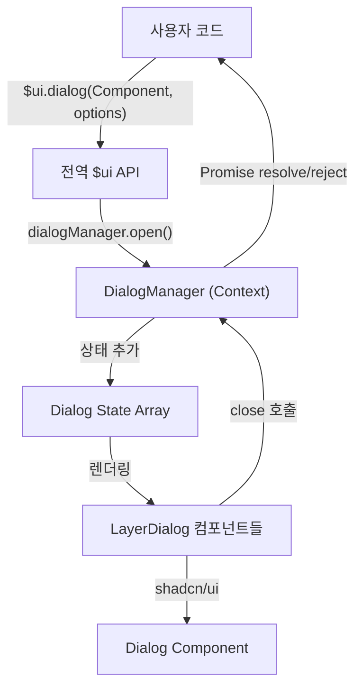

# Layer Dialog 구현 계획

## 개요

전역 API `$ui.dialog(Component, options)`로 손쉽게 호출할 수 있는 Layer Dialog 시스템을 구축합니다.

## 아키텍처



## 주요 기능

### 1. 간편한 호출 방식

```typescript
// 기본 사용
const result = await $ui.dialog(MyComponent, {
	title: '제목',
	description: '설명',
	size: 'md',
});

// 커스텀 버튼
const confirmed = await $ui.dialog(ConfirmDialog, {
	title: '삭제 확인',
	footerButtons: [
		{ label: '취소', variant: 'outline', value: false },
		{ label: '삭제', variant: 'destructive', value: true },
	],
});
```

### 2. 지원 옵션

- `title`: 다이얼로그 제목
- `description`: 다이얼로그 설명
- `size`: 크기 (sm, md, lg, xl, full)
- `footerButtons`: 하단 버튼 배열 커스터마이징
- `closeOnOverlayClick`: 오버레이 클릭 시 닫기 여부 (기본: true)
- `showCloseButton`: X 버튼 표시 여부 (기본: true)

### 3. Promise 기반 결과 반환

- 확인/취소 등의 사용자 액션에 따라 원하는 값을 반환
- 컴포넌트에서 `onClose(value)` 호출로 결과 전달

### 4. 여러 다이얼로그 동시 관리

- Stack 구조로 여러 다이얼로그를 동시에 열 수 있음
- 각 다이얼로그는 독립적인 상태와 Promise를 관리

## 구현 파일 구조

```
src/core/
├── components/
│   └── layer-dialog/
│       ├── DialogManager.tsx       # Context + Provider + 상태 관리
│       ├── LayerDialog.tsx         # 개별 다이얼로그 컴포넌트 (shadcn/ui Dialog 래핑)
│       ├── types.ts                # 타입 정의
│       └── index.ts                # export
├── common/
│   ├── ui/
│   │   └── index.ts                # 전역 $ui 객체 정의 및 export
│   └── providers/
│       └── AppProviders.tsx        # DialogProvider 추가 (수정)
└── types/
    └── global.d.ts                 # 전역 $ui 타입 선언 (신규 또는 기존 파일)
```

## 구현 단계

### 1단계: 타입 정의

[`src/core/components/layer-dialog/types.ts`](src/core/components/layer-dialog/types.ts) 생성

- `DialogOptions` 인터페이스
- `DialogState` 인터페이스
- `FooterButton` 인터페이스 등

### 2단계: DialogManager 구현

[`src/core/components/layer-dialog/DialogManager.tsx`](src/core/components/layer-dialog/DialogManager.tsx) 생성

- React Context로 다이얼로그 상태 배열 관리
- `openDialog(component, options)` 메서드: 새 다이얼로그 추가 및 Promise 반환
- `closeDialog(id, value)` 메서드: 다이얼로그 제거 및 Promise resolve

### 3단계: LayerDialog 컴포넌트 구현

[`src/core/components/layer-dialog/LayerDialog.tsx`](src/core/components/layer-dialog/LayerDialog.tsx) 생성

- shadcn/ui [`Dialog`](src/core/components/shadcn/ui/dialog.tsx) 컴포넌트 사용
- props로 전달된 Component 렌더링
- title, description, size에 따른 스타일 적용
- footerButtons 렌더링
- X 버튼 / 닫기 버튼 클릭 시 `closeDialog()` 호출

### 4단계: 전역 $ui API 구현

[`src/core/common/ui/index.ts`](src/core/common/ui/index.ts) 생성

- `$ui.dialog()` 메서드 구현
- DialogManager의 Context API 호출
- 전역 객체로 export

### 5단계: Provider 통합

[`src/core/common/providers/AppProviders.tsx`](src/core/common/providers/AppProviders.tsx) 수정

- DialogProvider를 Provider 체인에 추가

### 6단계: 전역 타입 선언

`@types/index.d.ts` 또는 별도 전역 타입 파일 수정

- `$ui` 객체를 전역에서 사용 가능하도록 타입 선언

## 기술적 고려사항

1. **상태 관리**: 각 다이얼로그는 고유 ID를 가지며 배열로 관리
2. **z-index**: 여러 다이얼로그 오픈 시 순서대로 z-index 증가
3. **메모리 관리**: 다이얼로그 닫힐 때 상태와 Promise 정리
4. **타입 안정성**: 제네릭으로 반환 타입 지정 가능
5. **접근성**: shadcn/ui Dialog의 접근성 기능 활용

## 사용 예시

```typescript
// 간단한 알림
await $ui.dialog(AlertContent, {
	title: '알림',
	description: '저장되었습니다.',
});

// 확인 다이얼로그
const confirmed = await $ui.dialog<boolean>(ConfirmContent, {
	title: '삭제하시겠습니까?',
	footerButtons: [
		{ label: '취소', value: false },
		{ label: '삭제', value: true, variant: 'destructive' },
	],
});

if (confirmed) {
	// 삭제 로직
}

// 폼 입력 다이얼로그
const formData = await $ui.dialog<FormData>(FormDialog, {
	title: '사용자 추가',
	size: 'lg',
});
```
